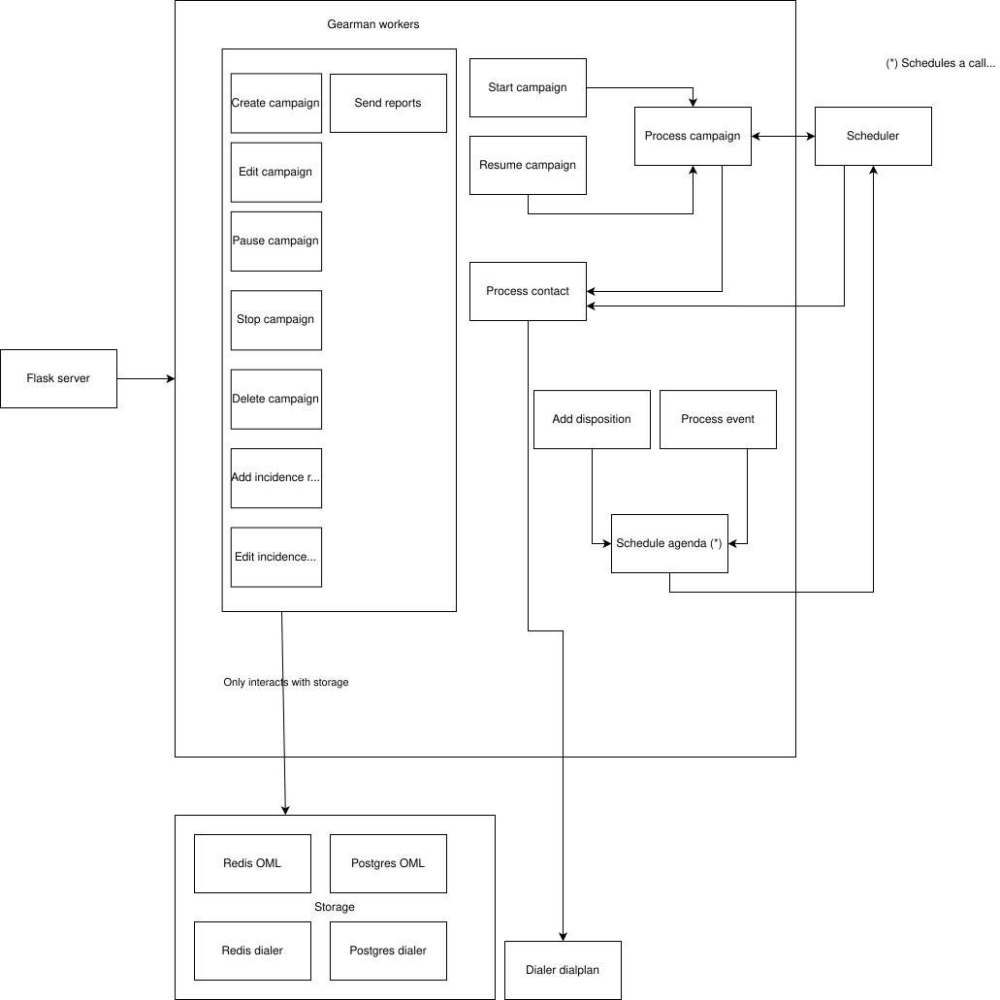

Descripción general
===================

Omnidialer (OMD) es un software de marcador diseñado como un componente FLOSS para Omnileads (OML) que puede usarse como una alternativa al marcador Wombat.

Está implementado en Python y utiliza componentes como Docker, docker-compose, Postgres, Redis y Gearman.

El uso de Gearman permite escalar horizontalmente el sistema de manera sencilla agregando trabajadores de Gearman dedicados a los recursos que más consumen tiempo y memoria.

El sistema está diseñado para ejecutarse en cualquier sistema GNU/Linux que soporte bash, docker y docker-compose.

Puede ejecutarse en el mismo host en el que se ejecuta OML o en un host externo configurando las variables de entorno presentes en el archivo env.
Las variables de entorno relevantes en este caso son: *GEARMAN_OML_SERVER*, *GEARMAN_OML_PORT*, *REDIS_OML_SERVER*, *REDIS_OML_PORT*, *ASTERISK_APP*, *ASTERISK_USER*, *ASTERISK_PASS*, *ASTERISK_HOST*, *ASTERISK_PORT*, *DIALER_ACD_HOST*, *POSTGRES_OML_PASSWORD*, *POSTGRES_OML_SERVER* y *POSTGRES_OML_PORT* .

Uso:

Asegúrate de tener Docker y Docker-Compose instalados y de que tienes la shell bash disponible.

Luego, realiza lo siguiente:

```
cp env .env
docker-compose build
docker-compose up -d
```

Un servidor Flask estará corriendo en 0.0.0.0:1440 con un job server de Gearman y los workers de Gearman necesarios.

Después de esto, puedes acceder a los diferentes endpoints para interactuar con el sistema. Consulta la carpeta 'test/curls' para ver algunos ejemplos.


Explicación de Endpoints
=======================

Crear campaña
---------------

### Endpoint: `[POST] /create-campaign/<id_campaign>`

#### Descripción
El endpoint create-campaign crea una campaña dentro de OMD importando los datos relacionados desde una campaña de OML.

El valor <id_campaign> corresponde al id de una campaña de OML, y será también el id de la nueva campaña en OMD.

Los otros valores importados desde OML son los campos estado, nombre, fecha_inicio, fecha_fin, control_de_duplicados y prioridad de la tabla ominicontacto_app_campana, que se copiarán a la tabla _campaign_. Adicionalmente, se importarán las entradas relacionadas con reglas de incidencia y contactos en las tablas _incidence_rules_, _incidence_rules_disposition_, _contact_in_campaign_ y _contact_, respectivamente.

El parámetro JSON _contact_strategy_ también se agrega como un campo de la tabla campaign. Esto se usará en el futuro para personalizar la forma en que el marcador llama más de una vez a un contacto en la campaña actual.

#### Método
- **Método HTTP:** `POST`

### Cuerpo de la solicitud
```json
{
  "contact-strategy": "[<id_strategy1>, <id_strategy2>, ... ,<id_strategy_n>]"
}
```


Editar campaña
---------------

### Endpoint: `[POST] /edit-campaign/<id_campaign>`

#### Descripción
El endpoint edit-campaign edita una campaña en OMD modificando los datos relacionados con los valores actuales de la campaña con el mismo id en OML.

El valor <id_campaign> corresponde al id de una campaña en OML y OMD.

Las tablas _campaign_, _incidence_rules_ e _incidence_rules_disposition_ podrían modificarse de acuerdo con los datos existentes en OML.

#### Método
- **Método HTTP:** `POST`

### Cuerpo de la petición
```json
{
  "contact-strategy": "[<id_strategy1>, <id_strategy2>, ... ,<id_strategy_n>]"
}
```


Iniciar campaña
---------------

### Endpoint: `[POST] /start-campaign/<id_campaign>`

#### Descripción

El endpoint start-campaign inicia el proceso principal de la campaña, estableciendo el campo 'dialer_status' en estado ACTIVO e iniciará un bucle que llamará a los contactos de la base de datos OMD de acuerdo con la configuración de la campaña y los agentes disponibles en OML.

El valor <id_campaign> corresponde al id de una campaña en OML y OMD.

#### Método
- **Método HTTP:** `POST`


Pausar campaña
---------------

### Endpoint: `[POST] /pause-campaign/<id_campaign>`

#### Descripción

El endpoint pause-campaign pausa el proceso de la campaña en OMD modificando el campo dialer_status de la entrada de la campaña al valor PAUSED.

El valor <id_campaign> corresponde al id de una campaña en OML y OMD.

#### Método
- **Método HTTP:** `POST`


Reanudar campaña
---------------

### Endpoint: `[POST] /resume-campaign/<id_campaign>`

#### Descripción

El endpoint resume-campaign reanuda el proceso de la campaña en OMD modificando el campo dialer_status de la entrada de la campaña al valor RESUMED y reiniciará el proceso de la campaña.

El valor <id_campaign> corresponde al id de una campaña en OML y OMD.

#### Método
- **Método HTTP:** `POST`

Detener (finalizar) campaña
---------------
### Endpoint: `[POST] /post-campaign/<id_campaign>`

#### Descripción

El endpoint post-campaign detiene una campaña en ejecución estableciendo primero el campo dialer_status en estado FINALIZED y después copiará todas las entradas relacionadas con la campaña en las tablas históricas. Las entradas se mueven a las tablas campaign_historic, contact_in_campaign_historic, incidence_rules_historic e incidence_rules_disposition_historic. Finalmente, la campaña original y las tablas relacionadas se eliminan de la base de datos como si se estuviera usando el endpoint delete-campaign.

Eliminar campaña
---------------

### Endpoint: `[POST] /delete-campaign/<id_campaign>`

#### Descripción

El endpoint delete-campaign primero pausa una campaña y luego la elimina por completo de la base de datos; las tablas _campaign_, _incidence_rules_, _incidence_rules_disposition_ y _contact_in_campaign_ pueden verse afectadas con este endpoint.

El valor <id_campaign> corresponde al id de una campaña en OML y OMD.

#### Método
- **Método HTTP:** `POST`


Agregar calificación para el contacto
-------------------------------------

### Endpoint: `[POST] /add-incidence-rule-disposition/<id_campaign>`

#### Descripción
El endpoint add-incidence-rule-disposition está diseñado para que OML indique que se ha agregado una opción de disposición a un contacto en la campaña y que debe analizarse una regla de incidencia en este caso. OMD agregará la información sobre la disposición al historial de contactos de la campaña y, si la regla de incidencia vinculada coincide, programará una llamada para el contacto.

El valor <id_campaign> corresponde al id de una campaña en OML y OMD.

#### Método
- **Método HTTP:** `POST`

### Cuerpo de la petición
```json
{
        "id_contact": <id_contact>,
        "disposition_option": <id_disposition_option>
}
```


Adicionar regla de incidencia
-----------------------------

### Endpoint: `[POST] /create-incidence-rule/<id_campaign>`

#### Descripción
El endpoint create-incidence-rule crea una regla de incidencia en una campaña.

El valor <id_campaign> corresponde al id de una campaña en OML y OMD.
Otros parámetros son:
<id_rule> - el id de la regla de incidencia en OML
<max_attempt> - número máximo de intentos
<retry_later> - delay (en segundos) antes de cada intento
<mode> - modo: fijo o multinum
<type> - 1 (si la regla de incidencia es de tipo 'status') or 2 (si la regla de incidencia es de tipo 'calificación')
<status> - id del status (solo si <type> es 1)
<status_custom> - nombre del status (solo si <type> es 1)
<disposition_option_id> - id de la calificacion aplicada en OML (solo si <type> es 2)


#### Método
- **Método HTTP:** `POST`

### Cuerpo de la petición
```json
{
        "id_rule": 3,
        "status": 3,
        "status_custom": "no answer",
        "max_attempt": 5,
        "retry_later": 5,
        "mode": 1,
        "type": 1

}


Modificar regla de incidencia
-----------------------------

### Endpoint: `[POST] /update-incidence-rule/<id_campaign>`

#### Descripción
El endpoint update-incidence-rule modifica una regla de incidencia en una campaña.

El valor <id_campaign> corresponde al id de una campaña en OML y OMD.
Otros parámetros son:
<id_rule> - el id de la regla de incidencia en OML
<max_attempt> - número máximo de intentos
<retry_later> - delay (en segundos) antes de cada intento
<mode> - modo: fijo o multinum
<type> - 1 (si la regla de incidencia es de tipo 'status') or 2 (si la regla de incidencia es de tipo 'calificación')
<status> - id del status (solo si <type> es 1)
<status_custom> - nombre del status (solo si <type> es 1)
<disposition_option_id> - id de la calificacion aplicada en OML (solo si <type> es 2)


#### Método
- **Método HTTP:** `POST`

### Cuerpo de la petición
```json
{
        "id_rule": 3,
        "status": 3,
        "status_custom": "no answer",
        "max_attempt": 5,
        "retry_later": 5,
        "mode": 1,
        "type": 1

}
```

Eliminar regla de incidencia
----------------------------

### Endpoint: `[POST] /delete-incidence-rule/<id_campaign>`

#### Descripción
El endpoint delete-incidence-rule elimina un regla de incidencia en una campaña

El parámetro <id_campaign> corresponde al id de una campaña in OML y OMD.

Otros parámetros son:
<id> - id de la regla de la regla de incidencia en OML
<type> - tipo: 1 para reglas de incidencia de tipo status, 2 para reglas de incidencia de tipo calificación


#### Método
- **Método HTTP:** `POST`

### Cuerpo de la petición
```json
{
        "id": 3,
        "type": 1
}


Adicionar agenda para llamar
----------------------------

### Endpoint: `[POST] /add-agenda/<id_campaign>`

#### Descripción
El endpoint add-agenda programa una llamada en una determinada fecha y hora.

El parámetro <id_campaign> corresponde al id de una campañan en OML y OMD.

Otros parámetros son:
<id_contact> - el contacto a llamar
<campaign_name> - el nombre de la campaña en OML
<phone_number> - número de teléfono a llamar
<datetime> - la fecha y hora en que se realizará la llamada


#### Método
- **Método HTTP:** `POST`

### Cuerpo de la petición
```json
{
        "id_contact": 7,
        "campaign_name": "clonan_33",
        "phone_number": "313123427",
        "datetime": "27/11/24 15:42:00"
}
```

Cambiar base de datos de contactos
----------------------------------

### Endpoint: `[POST] /change-database/<id_campaign>`

#### Descripción
El endpoint change-database pausa la campaña y reemplaz los contactos en la campaña con los contactos recientemente reemplazados en la campaña de mismo id en OML.
También elimina todos los reportes e historial associado a la campaña.

El parámetro <id_campaign> corresponde a el id de una campaña en OML y OMD.

#### Método
- **Método HTTP:** `POST`


Arquitectura
============

La arquitectura del sistema se muestra en el siguiente diagrama:



El sistema atiende los endpoints con un servidor Flask que, a su vez, redirige las tareas a los workers de Gearman en ejecución.

También hay un servidor de websocket que recibirá los eventos ARI vinculados a las llamadas y redirigirá la tarea a un trabajador de Gearman.

Los datos del sistema se almacenan en una instancia de Postgres y algunos datos se replican en una instancia de Redis.

Los datos guardados en Redis están relacionados con el historial de contactos en una campaña e informes de la campaña.

El sistema también publica en canales PUBSUB información sobre informes y estado de las campañas.

También es posible agendar llamadas usando un scheduler personalizado.

Debería haber un worker de la función de Gearman 'process-campaign' por cada campaña discando en paralelo.

El sistema también incluye un simple admin que permite algun grado de administración de las campañas y manipular el status del sistema (start, stop y restart) de forma controlada.

Escalabilidad horizontal
========================

El sistema está diseñado para escalar horizontalmente simplemente creando más servidores de trabajos y trabajadores de Gearman.

Para agregar más job servers de Gearman, se deberá modificar la variable de entorno GEARMAN_JOB_SERVERS y agregar un nuevo job server de la siguiente manera:

$ docker run --rm -itd -p 4731:4731 --network=omnileads_omnileads --name=gearman_job_server_2 artefactual/gearmand:1.1.18-alpine

También puede agregar más trabajadores en el mismo host de la siguiente manera:

$ bash add-worker-single-job.bash <name_of_the_gearman_job_to_serve> <new_container_name> <oml-docker-network>

Por ejemplo:

$ bash add-worker-single-job.bash process-contact process-contact-5 omnileads_omnileads


Si estás en otro host, puedes ejecutar el archivo docker-compose docker-compose-single-worker.yml después de configurar los valores relevantes en el archivo .env y, después de eso, agregar más trabajadores según sea necesario.


Tests
=====

Para ejecutar las pruebas unitarias, simplemente haz lo siguiente:

$ bash run-tests.bash


Logging
=======

Si deseas ver logs de depuración en cada trabajador, debes cambiar la variable de entorno PYTHON_LOGLEVEL de _warning_ a _debug_.
